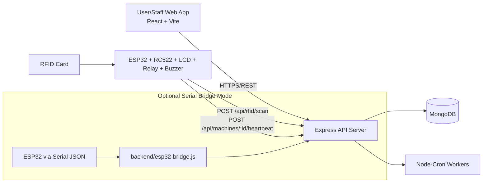

# LUNEX — Complete System Documentation

> **Tagline:** Book Smart. Wash Easy. Live Better.

This document describes the **full LUNEX system** across:
- Hardware (ESP32 + RFID + relay + buzzer + LCD)
- Backend (Node.js/Express/MongoDB)
- Frontend (React/Vite)
- End-to-end workflow, architecture, and runtime behavior

---

## 1) System Purpose

LUNEX is a smart hostel laundry management platform where:
- Users reserve washing-machine time slots.
- Access is enforced physically using RFID scans at the machine.
- Session lifecycle (start, extend, pause, end, auto-end) is tracked in backend.
- Admin/Warden staff control operations, users, machines, issues, and emergency actions.

---

## 2) High-Level Architecture



### Core Layers
- **Frontend:** Role-based UI for users, wardens, admins.
- **Backend API:** Business rules, auth, booking/session control, issue flows, analytics.
- **Database:** Persistent state for users, machines, bookings, sessions, notifications, configs.
- **IoT Hardware:** On-site access control and relay switching for actual machine power.
- **Cron jobs:** Automated reminders, no-show handling, auto-end, priority expiry, heartbeat health.

---

## 3) Hardware Side (Complete)

Hardware implementation is in `backend/ESP32_LUNEX_INTEGRATED.ino`.

## 3.1 Components
- ESP32
- RC522 RFID reader (via UART input in current sketch)
- Relay module (controls machine power line)
- Buzzer (audible status)
- I2C LCD 16x2 (status display)
- Wi-Fi network connectivity

## 3.2 Pin Mapping (Current Sketch)
- `RELAY_PIN = 5`
- `BUZZER_PIN = 18`
- `RFID_RX = 17`
- LCD initialized with I2C address `0x27`

## 3.3 Device Identity and Network
- Wi-Fi SSID/password hardcoded in sketch.
- Backend endpoint: `POST /api/rfid/scan`
- Machine identity sent as `MACHINE_ID` (example: `WM-001`)

## 3.4 Embedded Runtime Flow
1. Boot, initialize LCD, relay (OFF), buzzer, RFID serial.
2. Connect to Wi-Fi (auto-reconnect loop in `loop()`).
3. Wait for card tap.
4. Read and normalize RFID UID (hex uppercase).
5. Send JSON payload:
   - `rfidUID`
   - `machineId`
6. Parse backend response text and map action to hardware behavior.

## 3.5 Hardware Action Mapping
- `POWER_ON`:
  - Relay ON (machine power enabled)
  - Access granted LCD
  - success beep pattern
- `POWER_OFF`:
  - Relay OFF
  - session end LCD
  - short beep
- `TOO_EARLY` / `NOT_STARTED`:
  - "Wait Slot Time"
  - continuous buzz
- `EXPIRED`:
  - "Slot Expired"
  - continuous buzz
- `NO_WIFI`:
  - Wi-Fi error display + reconnect
- Any other result:
  - Access denied
  - long buzz
  - if no active machine run, ensure relay OFF

## 3.6 Security/Operational Note
- `/api/rfid/scan` is currently a public route in backend (no JWT requirement).
- Physical-network security and backend network isolation are important in production.

---

## 4) Optional Bridge Mode (Serial Integration)

Bridge implementation exists in `backend/esp32-bridge.js`.

### Purpose
- Reads JSON messages from ESP32 over serial (`COM_PORT`, `BAUD_RATE`).
- Forwards RFID/heartbeat to backend API.
- Sends response commands back to ESP32 as JSON.

### Important Compatibility Note
- Current integrated firmware (`ESP32_LUNEX_INTEGRATED.ino`) uses **direct HTTP**, not serial JSON protocol expected by bridge.
- So there are effectively **two integration patterns** in repository:
  1. **Direct HTTP device mode** (current `.ino` behavior)
  2. **Serial bridge mode** (requires matching ESP32 serial JSON firmware)

Use one consistent mode per deployment.

---

## 5) Backend Software Architecture

## 5.1 Entry and Middleware
- Entry: `backend/src/server.js`
  - Loads `.env`
  - Connects MongoDB
  - Starts cron jobs
  - Starts Express server (default port 5000)
- App config: `backend/src/app.js`
  - `helmet`, `cors`, JSON parsers, `morgan` in development
  - health routes `/` and `/api/health`
  - registers all API route modules
  - global error handling

## 5.2 Auth and Authorization
- JWT access + refresh token strategy.
- Access token in `Authorization: Bearer <token>`.
- Refresh endpoint issues rotated tokens.
- Middleware:
  - `protect`: blocks pending/blocked users
  - `protectAllowPending`: used for status checks
- Role controls via `authorize(...)` middleware.

## 5.3 Domain Modules
- Auth
- Booking
- Machine
- Session
- RFID
- Issue + Priority Rebook
- Notification
- Admin (users, config, emergency, analytics)

---

## 6) Frontend Software Architecture

## 6.1 Stack and Runtime
- React + Vite + Tailwind.
- API client: Axios with interceptors.
- Auto token attach + refresh flow on 401.

## 6.2 Routing and Role Gating
- Public pages: Login, Register, Pending Approval.
- Protected app shell (`Layout`) for authenticated users.
- Staff routes (warden/admin), admin-only sub-routes enforced in UI and backend.

## 6.3 Main User Flows in UI
- Dashboard overview (machines, bookings, active session, unread notifications)
- Machine listing
- New booking wizard (machine/date/duration/slot)
- My bookings
- Active session management (extend/end)
- Session history
- Issue reporting and rebook responses
- Notifications and profile

## 6.4 Staff/Admin UI
- Admin dashboard analytics
- User lifecycle management and RFID assignment
- Booking/session global views
- Machine management and status control
- Issue triage (verify/resolve/dismiss)
- System config editing
- Emergency shutdown/reset controls

---

## 7) Data Model (MongoDB)

### `User`
- Identity/profile: name, email, phone, room/block
- Auth: password hash, refreshToken, lastLogin
- Role/status: user/warden/admin, pending/active/blocked/rejected
- RFID binding: `rfidUID` (unique partial index)
- Counters: noShowCount, totalBookings, totalSessions, hasPriorityRebook

### `Machine`
- machineId, name, location
- status (`available`, `in-use`, `maintenance`, `repair`, `disabled`)
- online health (`isOnline`, `lastHeartbeat`)
- runtime links (`currentBooking`, `currentSession`)
- usage counters and maintenance metadata

### `Booking`
- user, machine, slotDate, start/end, duration (15/30/45/60)
- status lifecycle (`confirmed`, `active`, `completed`, `cancelled`, `no-show`, `interrupted`)
- timing markers (arrived, cancelled, no-show, reminders)
- optional linked session

### `Session`
- booking/user/machine references
- status (`running`, `paused`, `completed`, `terminated`, `interrupted`)
- timing fields: started/scheduledEnd/actualEnd
- extension and pause tracking
- termination metadata (`terminatedBy`)

### `Issue`
- reporter, machine, optional booking/session
- type (`water`, `power`, `machine-fault`, `other`)
- status (`reported`, `verified`, `resolved`, `dismissed`)
- verification/resolution metadata
- flags for paused session and priority rebook offered

### `PriorityRebook`
- user + original booking + issue
- offered slot (machine/start/end)
- status (`offered`, `accepted`, `declined`, `expired`, `completed`)
- expiry + accepted new booking reference

### `Notification`
- user, type, title, message, payload data
- read state, optional push state

### `SystemConfig`
- key/value runtime config store
- description and updater metadata

### Additional Operational Collections
- `BookingLock`: per-minute lock records to prevent slot race/overlap.
- `UserDailyBookingCounter`: enforce per-user daily booking max.

---

## 8) API Surface (Route Map)

## 8.1 Auth (`/api/auth`)
- `POST /register`
- `POST /login`
- `POST /refresh-token`
- `GET /status` (pending allowed)
- `GET /me`
- `PUT /profile`
- `PUT /change-password`
- `POST /logout`

## 8.2 Bookings (`/api/bookings`)
- `POST /`
- `GET /my`
- `GET /slots/:machineId/:date`
- `GET /all` (warden/admin)
- `GET /:id`
- `PUT /:id/cancel`

## 8.3 Machines (`/api/machines`)
- `POST /:machineId/heartbeat` (public hardware endpoint)
- `GET /`
- `GET /:machineId`
- `POST /` (admin)
- `PUT /:machineId` (admin)
- `DELETE /:machineId` (admin)
- `PUT /:machineId/status` (warden/admin)

## 8.4 Sessions (`/api/sessions`)
- `POST /start`
- `GET /active`
- `POST /:id/extend`
- `POST /:id/end`
- `POST /:id/pause` (warden/admin)
- `POST /:id/resume` (warden/admin)
- `POST /:id/force-stop` (warden/admin)
- `GET /history`
- `GET /all` (warden/admin)

## 8.5 RFID (`/api/rfid`)
- `POST /scan` (public hardware endpoint)
- `POST /validate` (admin)

## 8.6 Issues (`/api/issues`)
- `POST /`
- `GET /my`
- `GET /priority-rebook/pending`
- `PUT /priority-rebook/:id/respond`
- `GET /all` (warden/admin)
- `PUT /:id/verify` (warden/admin)
- `PUT /:id/resolve` (warden/admin)
- `PUT /:id/dismiss` (warden/admin)
- `POST /:id/priority-rebook` (warden/admin)

## 8.7 Notifications (`/api/notifications`)
- `GET /`
- `GET /unread-count`
- `PUT /read-all`
- `PUT /:id/read`
- `DELETE /:id`

## 8.8 Admin (`/api/admin`)
- User mgmt: list/pending/approve/reject/block/unblock/assign-rfid/revoke-rfid/change-role/reset-password
- Config mgmt: `GET/PUT/DELETE /config`
- Emergency: `POST /emergency/shutdown`, `POST /emergency/reset`
- Analytics: dashboard/machine-utilization/no-shows/peak-usage

---

## 9) End-to-End Workflow (How It Works)

## 9.1 User Registration and Approval
1. User registers (status = `pending`).
2. Admin approves account (`active`) and assigns RFID.
3. User logs in and can book slots.

## 9.2 Booking Workflow
1. User selects machine/date/duration.
2. Backend validates:
   - no past slot
   - max advance window
   - max bookings/day
   - machine availability and status
   - overlap conflict (user + machine)
3. BookingLock minute-level records are inserted (with buffer).
4. Booking created as `confirmed`.
5. Notification generated.

## 9.3 Machine Access via RFID
1. User reaches machine and taps RFID card.
2. ESP32 sends UID + machineId to `/api/rfid/scan`.
3. Backend validates user, account, machine, booking time window.
4. If valid:
   - Session created (`running`)
   - Booking -> `active`
   - Machine -> `in-use`
   - Response action `POWER_ON`
5. ESP32 turns relay ON and starts run physically.

## 9.4 Session Runtime
- User can view active session timer.
- One-time extension allowed (bounded by configured extension + slot buffer and next-slot conflict check).
- Warden/admin can pause/resume/force-stop.

## 9.5 Session End
- Ends by:
  1. User RFID scan on same machine (power off flow), or
  2. User/staff API end call, or
  3. Auto-end cron when scheduled/extended end time reached.
- On end:
  - Session completed/terminated
  - Booking completed/interrupted
  - Machine freed to `available`
  - Usage counters incremented
  - Notifications sent

## 9.6 Issue and Priority Rebook Workflow
1. User reports issue.
2. If active session linked, session pauses.
3. Staff verify and resolve/dismiss.
4. On resolve, paused session can resume with compensated end time.
5. Staff can offer priority rebook (time-limited offer).
6. User accepts/declines before expiry.

## 9.7 No-Show and Reminder Automation
- Pre-start reminder before slot start.
- If user doesn’t arrive within grace period:
  - booking -> `no-show`
  - no-show count increment
  - slot released

---

## 10) Scheduler / Automation Jobs

Configured in `backend/src/cron/cronJobs.js`:
- Every minute: booking start reminders
- Every minute: no-show detection and cancellation
- Every minute: auto-end expired sessions
- Every minute: session-ending reminders (~5 min left)
- Every 5 minutes: expire stale priority rebook offers
- Every 5 minutes: mark machines offline if heartbeat stale (>10 min)

---

## 11) Runtime Configuration Controls

Runtime values can come from `SystemConfig` (preferred), then env fallback:
- `grace_period_minutes`
- `reminder_before_minutes`
- `buffer_between_slots_minutes`
- `extension_minutes`
- `max_bookings_per_day`
- `max_advance_booking_days`

These configs directly influence booking constraints and cron behavior.

---

## 12) Environment and Deployment Notes

## 12.1 Backend
- Default port: `5000`
- Requires:
  - `MONGO_URI`
  - `JWT_SECRET`
  - `JWT_REFRESH_SECRET`
  - token expiry vars (optional with defaults)
  - optional RFID/admin bootstrap vars

## 12.2 Frontend
- Vite dev default in project scripts.
- API base:
  - from `VITE_API_BASE_URL`, else
  - localhost uses `http://localhost:5000/api`, otherwise hosted Render URL.

## 12.3 Seed and Bootstrap
- `npm run seed` in backend seeds:
  - admin, warden, test user
  - machines
  - default system configs
- `npm run bootstrap:admin` ensures an admin exists/active.

---

## 13) State Machines (Business Status Transitions)

### Booking
- `confirmed` -> `active` -> `completed`
- `confirmed` -> `cancelled`
- `confirmed` -> `no-show`
- `active/confirmed` -> `interrupted` (fault/emergency/admin actions)

### Session
- `running` -> `paused` -> `running`
- `running/paused` -> `completed`
- `running/paused` -> `terminated`
- `running` -> `interrupted`

### Machine
- `available` <-> `in-use`
- Any -> `maintenance`/`repair`/`disabled` by staff/admin
- Emergency reset can return disabled machines to available

---

## 14) Security, Reliability, and Operational Considerations

- JWT-based auth and role checks are enforced for protected APIs.
- RFID and heartbeat endpoints are public by design for device access.
- Booking conflicts are guarded with transactional logic + lock collection.
- Cron automation guarantees session cleanup and operational consistency.
- Notifications are persisted in DB; push delivery is currently a TODO in service code.

---

## 15) Current Repository Layout

- `frontend/` — React client
- `backend/src/` — API, domain logic, models, cron, middleware
- `backend/ESP32_LUNEX_INTEGRATED.ino` — direct HTTP firmware
- `backend/esp32-bridge.js` — optional serial bridge integration
- `backend/LUNEX_API.postman_collection.json` — API collection

---

## 16) Quick Start (Operational)

### Backend
```bash
cd backend
npm install
npm run dev
```

### Frontend
```bash
cd frontend
npm install
npm run dev
```

### Optional Seed
```bash
cd backend
npm run seed
```

---

## 17) Practical Integration Checklist

1. Create machine entries in DB (match `machineId` used by ESP32).
2. Approve user accounts and assign RFID cards.
3. Ensure ESP32 has correct backend URL and machine ID.
4. Confirm machine heartbeat updates `isOnline`.
5. Book slot and validate RFID start/end cycle physically.
6. Verify cron effects (no-show cancellation, auto-end, reminders).
7. Validate emergency shutdown/reset behavior from admin panel.

---

If you want, this can be extended with **sequence diagrams per API workflow** and an **environment variable reference table** from your `.env` templates.